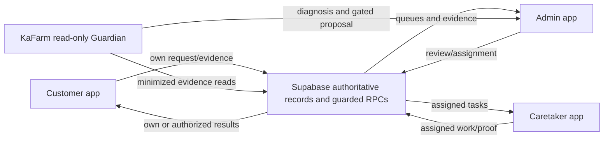

# FarmConnect App Master Blueprint

Blueprint version: `0.1.0-draft`
Prepared: 2026-08-18
Status: **HOLD — APP DEFINITION IS NOT COMPLETE**
Authority: Tina, the FarmConnect owner, is the final product authority.

This document is the proposed single source of truth for FarmConnect. It describes product intent; existing code is evidence, not automatic approval. No new implementation is authorized by this draft.

## 1. Evidence classification

| Class | Meaning | Authority |
|---|---|---|
| OWNER APPROVED | Tina explicitly decided the behavior in the recorded working history | Product authority unless superseded by a later owner decision |
| VERIFIED CURRENT BEHAVIOR | A current, identified build or live workflow produced direct evidence | Runtime truth for that tested release only |
| EXISTING IMPLEMENTATION | Present in repository source or numbered migration | Descriptive, not automatically intended |
| PROPOSED | A design, Guardian feature, SQL proposal, or future improvement not approved/applied | Cannot control the Builder |
| CONFLICTING | Two sources prescribe different behavior | Owner decision or correction required |
| UNKNOWN | Evidence is absent or insufficient | Builder must not guess |

Precedence is: latest explicit owner decision → locked blueprint → verified behavior on the same release → implementation evidence → proposal. Security invariants cannot be weakened by UI preference.

## 2. Application identity and purpose

Application name: **FarmConnect**.

Business purpose: connect customer rooster ownership, farm purchases, care operations, caretaker work, evidence, inventory, sale, wallet, and withdrawal into one traceable operating record. It solves the operational risk created when ownership, physical work, inventory, approvals, and money are maintained in separate or unverifiable records.

Primary value:

- Customers can see what they own, requested, paid for, and received.
- Admin controls sensitive approvals and assignments.
- Caretakers receive exact work, safety guidance, and proof requirements.
- Inventory and money changes are evidence-backed, linked, and idempotent.
- KaFarm helps trace the last proven-good state and first broken or unproven step without fabricating data.

## 3. Target roles

### ROLE-CUS — Customer

- Purpose: buy roosters/supplies, request care, track owned roosters and care, sell a rooster, manage wallet/payout, submit KYC, and receive evidence.
- May see: own profile, own KYC status, own inventory, own roosters, own care records, own payment/withdrawal/inbox records, and approved proof linked to them.
- May do: create only their own requests; upload their own evidence; confirm a reviewed sale or received payout.
- Must never: approve a payment/KYC/proof, assign a caretaker, see another customer's private data, directly credit a wallet, or change ownership.

### ROLE-CARE — Caretaker

- Purpose: perform assigned farm work and submit accurate proof, observations, health status, and actual inventory use.
- May see: own approved caretaker profile and tasks explicitly assigned to them, including the minimum customer/rooster context needed for the task.
- May do: submit proof for an assigned active/backjob task, flag health/safety problems, and contact Admin.
- Must never: self-assign work, approve proof, change a customer wallet/ownership/KYC, see unrelated customers, or mark unsafe/incomplete work complete.

### ROLE-ADM — Admin

- Purpose: review queues, make sensitive decisions, assign work, inspect evidence, reconcile records, and operate the farm.
- May see: records necessary for authorized operational review, subject to private-evidence controls and audit.
- May do: approve/reject/needs-info through canonical guarded RPCs; assign active caretakers; inspect evidence; manage incident recovery through official workflows.
- Must never: bypass ledgers, manufacture payment/ownership/KYC/proof, expose secrets, or use generic production SQL from the app.

### ROLE-SYS — FarmConnect system

- Purpose: enforce state transitions, idempotency, RLS, audit events, schedule authorized daily missions, and deliver notifications.
- Must never: make discretionary Admin decisions, infer payment, or silently complete a partial transaction.

### ROLE-KAF — KaFarm Guardian

- Purpose: read evidence, compare expected and actual workflow state, explain findings, and recommend or prepare a guarded recovery path.
- May see: minimized, FarmConnect-only evidence allowed to an active Admin.
- Must never: receive secrets, execute arbitrary SQL, move money, approve KYC/payment/proof, change ownership, or silently repair protected records.

## 4. System boundary



Supabase is the authoritative business-data store. Client state may present a pending state but may not declare completion before authoritative downstream records exist.

## 5. Approved product scope

| Domain | Required capability | Current classification |
|---|---|---|
| Authentication | One login; database role determines workspace | OWNER APPROVED + EXISTING IMPLEMENTATION |
| Customer signup | Create Auth user and exactly one customer profile | VERIFIED BASELINE + EXISTING IMPLEMENTATION |
| Caretaker registration | Application with private selfie/resume; Admin approval before access | OWNER APPROVED + VERIFIED BASELINE |
| KYC | Customer consent/evidence; Admin-only decision; approved profile sync | OWNER APPROVED + VERIFIED BASELINE |
| Farm Buy | Product/cart → proof → Admin review → inventory/ownership exactly once | OWNER APPROVED + VERIFIED BASELINE |
| Manual care | Owned rooster → inventory sufficiency/reservation → payment if required → Admin assignment → proof → review → Care Log | OWNER APPROVED; current full post-063 UI regression proof required |
| Paid Care Plan | Fixed 30 days/₱5,000 → payment review → Task Management assignment → automatic daily tasks → proof/review/Care Logs | OWNER APPROVED; implementation present; current full E2E not proven |
| Standard unpaid guidance | Same quality standard presented as daily KaFarm guidance; no automatic paid caretaker mission | OWNER APPROVED; verification incomplete |
| Inventory | Exact decimal quantities; reserve before promise; deduct verified actual use once | OWNER APPROVED + implementation evidence |
| Sell | No-price state → inspection → Admin-reviewed price → customer confirmation → release proof → ownership release and wallet credit exactly once | OWNER APPROVED + VERIFIED BASELINE |
| Wallet | Auditable transactions and held amounts; no fabricated balance | OWNER APPROVED + VERIFIED BASELINE |
| Withdrawal | Payout method can be added without KYC; submission requires approved KYC and wallet PIN; Admin proof; customer confirmation; Inbox evidence | OWNER APPROVED + VERIFIED BASELINE |
| Support | KaFarm first-line explanation; sensitive issues escalate to Admin | OWNER APPROVED + implementation evidence |
| KaFarm | Report, whole-app analysis, safe troubleshooting/Guardian; no SQL gateway or hidden mutation | OWNER APPROVED direction; exact final information architecture requires decision |

## 6. Critical workflow contracts

The detailed chains and state machines are in `WORKFLOW_CONTRACTS.md`.

| Workflow | Contract |
|---|---|
| AUTH-WF-001 | Signup/login and role routing |
| CARETAKER-WF-001 | Caretaker application and activation |
| KYC-WF-001 | Customer KYC review and profile reconciliation |
| BUY-WF-001 | Farm Buy manual payment to official ownership/inventory |
| CARE-WF-001 | One-time premium-standard care request |
| PLAN-WF-001 | Fixed ₱5,000 30-day Care Plan |
| PROOF-WF-001 | Caretaker proof, Admin review, inventory and customer release |
| SALE-WF-001 | Inspected rooster sale and wallet credit |
| WITHDRAW-WF-001 | Guarded withdrawal and customer confirmation |
| SUPPORT-WF-001 | Support escalation |
| KAFARM-WF-001 | Diagnosis and Resume From Failure |

## 7. Cross-cutting contracts

### Product truth

1. A visual success state is not business completion.
2. A workflow completes only when its required records, evidence, and cross-role result exist.
3. Retried submissions and decisions must be idempotent.
4. A reviewed record leaves the open queue and remains in history/evidence.
5. Never restart a transaction blindly. Resume after the last proven-good step.

### Frontend

Every action follows: validate → disable/loading → canonical request → authoritative response → refresh affected records → visible result. Duplicate clicks must not create duplicate records. Errors must name the next safe action without exposing internals or secrets.

### Backend

Protected changes use one authoritative guarded RPC. Direct client writes are allowed only for explicitly low-risk own-record operations protected by RLS. Money, KYC, payment review, proof review, role activation, and ownership changes are server-authoritative.

### Database

Critical writes must be atomic, idempotent, referentially linked, RLS-protected, and auditable. Ledger-like records are append-only in normal operation. No hardcoded customer record may define business behavior.

### Identity

For every protected action:

```text
auth.uid()
= expected profiles.auth_user_id
= authorized role/account status
= permitted record relationship
```

Otherwise the action is blocked.

### Evidence and privacy

Record actor, time, workflow, subject, previous state, new state, result, and safe error code. Never log passwords, Wallet PINs, service keys, tokens, full payout identifiers, or raw KYC documents.

## 8. UI information architecture

### Customer primary navigation

Approved primary destinations: My Roosters, Farm Buy, Farm Requests, Wallet. Secondary tools include Inbox, Support, Inventory, Settings, and Logout. **Care Plans must not be a separate top-nav item**; paid Care Plan entry lives in Farm Requests and per-rooster status lives in My Roosters.

### Caretaker primary navigation

Active Tasks, Completed, Chat Admin, Profile.

### Admin primary navigation

Dashboard, Customer Requests, Caretaker Management, Farm Operations, Issue Management, Account Verification, Evidence Logs, KaFarm.

Admin is desktop-first. Customer and Caretaker are mobile-first but must remain usable on tablet and desktop.

## 9. UI design contract summary

- Primary green: `#1f6b45`; deep green variants: `#075f48`, `#063e30`, `#102017`.
- Farm gold/yellow: `#ffd84a` and amber action accents.
- Warm surface: `#f6f3e8`; white/cream cards with dark green text.
- Error: red only for real rejection/failure/destructive warnings.
- Pending/needs attention: amber; verified/approved/completed: green.
- Rounded cards/buttons, strong headings, farm imagery, visible hierarchy, and readable high-contrast text.
- Detailed responsive and state rules are in `UI_UX_CONTRACT.md`.

## 10. Deployment contract

| Item | Contract |
|---|---|
| Repository | `tinaleung74-blip/farmconnect-live` (OWNER/implementation history) |
| Current development branch | `agent/kafarm-guardian` for blueprint/Guardian work; release branch decision required |
| Hosting | Vercel, production URL `https://farmconnect-live.vercel.app/` |
| Database | FarmConnect Supabase project ref `bfckjrqrixbtqqvsxgjq` |
| Migrations | Numbered, append-only; repository contains applied 001–066 and proposed 067–068 |
| Environment separation | Isolated/staging database is required for write-enabled automated E2E; production transactions must not be repeated for routine regression |
| Release compatibility | Tested commit, frontend APIs/RPCs, and applied migration version must match |
| Rollback | Redeploy last verified code; use forward-fix for additive DB changes; never single-row wallet/ownership repair without ledger reconciliation |

Required server-only variables include `SUPABASE_SERVICE_ROLE_KEY`, `OPENAI_API_KEY` when Guardian reasoning is enabled, `CRON_SECRET`, and explicit feature flags. Public URL/anon key may be client-visible; service-role and model keys may not.

## 11. Verified baseline and limits

Owner-recorded live baseline `LIVE-20260813-E2E-01` passed customer signup/KYC, Farm Buy/approval/ownership, paid care/assignment/proof/review, sell/price/release/wallet credit, and withdrawal/completed Inbox. This is historical evidence for the tested production release, not proof of later Care Plan/Guardian changes.

Current Guardian branch verification: build, TypeScript, targeted lint, security contract, Guardian safety contract, logic-gate unit tests, and local render passed. Proposed Guardian SQL 067–068 is not applied; no production mutation was performed.

## 12. Blocking decisions

| Decision | Status | Why Builder must stop |
|---|---|---|
| DEC-001 | OWNER DECISION REQUIRED | Final Dashboard cards replacing low-value Growing/Ready/Needs Attention metrics are not locked. |
| DEC-002 | OWNER DECISION REQUIRED | Exact unpaid daily-guidance interaction for multiple roosters (one card, carousel, list, prioritization) is not locked. |
| DEC-003 | RESOLVED IN 069 | `test:business`, SQL, and UI use a fixed 30-day ₱5,000 service total (₱166.67 displayed average/day). |
| DEC-004 | RESOLVED IN 069 | Customer-owned feed is required and reserved before payment; insufficient balance blocks the request and the plan never auto-purchases or credits missing feed. |
| DEC-005 | SECURITY DECISION REQUIRED | Password recovery is only a placeholder; approved reset and admin-assisted recovery policy is unknown. |
| DEC-006 | PRODUCT/LEGAL DECISION REQUIRED | KYC full ID vs last-four storage/validation and retention policy is unresolved. |
| DEC-007 | OWNER DECISION REQUIRED | Final KaFarm page architecture: legacy report/reader/troubleshooting plus Guardian, or consolidated three-page system. |
| DEC-008 | UX DECISION REQUIRED | Multi-tab role switching shares one Supabase browser session; final warning/isolation behavior is not specified. |
| DEC-009 | OPERATIONS DECISION REQUIRED | Restore drill, backup RPO/RTO, incident contacts, and production approval authority are not documented. |
| DEC-010 | SECURITY DECISION REQUIRED | Rate limits and abuse thresholds for signup, login, uploads, support, and financial requests are unknown. |
| DEC-011 | PRODUCT DECISION REQUIRED | Membership/cashin/locked-savings legacy routes are present but their approved commercial role is not established. |
| DEC-012 | DATA GOVERNANCE DECISION REQUIRED | Evidence, incident, KYC, caretaker resume, payment proof, and payout proof retention/deletion periods are unknown. |

## 13. Final gate

- [x] App purpose and roles defined.
- [x] Current page routes inventoried.
- [x] Critical UI elements inventoried at canonical-surface level.
- [x] Critical workflows and current state machines documented.
- [ ] All business-rule conflicts resolved.
- [ ] Database contract independently matched to live metadata for the release candidate.
- [ ] Identity fallback conflict resolved.
- [ ] UI/UX decisions DEC-001, DEC-002, DEC-007, and DEC-008 resolved.
- [ ] Error, rate-limit, retention, recovery, and deployment decisions completed.
- [ ] Six human/AI checkers approve.
- [ ] Owner explicitly approves this version.
- [ ] Builder interpretation has no critical PARTIAL/CONFLICT/UNKNOWN.

# HOLD — APP DEFINITION IS NOT COMPLETE

The Builder may inspect and report. The Builder may not use this draft as authority for new feature implementation.
